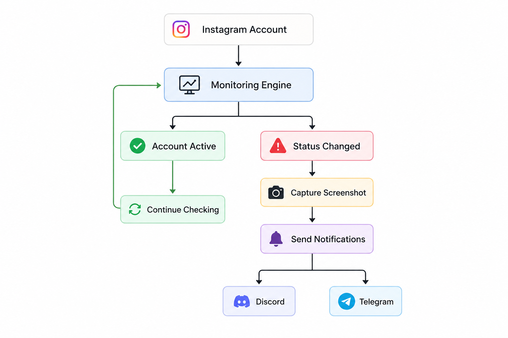

# 🚨 BHASKAR MONITOR

<p align="center">
  
  
  
  
</p>

<p align="center">
  <b>An automated Instagram account monitoring system that detects bans, unbans, captures screenshots, and sends instant alerts through Discord and Telegram.</b>
</p>

---

## 📌 Overview

**BHASKAR MONITOR** is an automated monitoring solution built to track Instagram account availability in real time.

The system continuously monitors configured Instagram accounts and detects important status changes such as:

- 🔴 Account banned / disabled detection
- 🟢 Account unbanned / restored detection
- 📸 Automatic screenshot capture during events
- 🔔 Discord notifications with evidence
- 📱 Telegram alerts
- ⚡ Automated background monitoring

Instead of manually checking accounts, BHASKAR MONITOR keeps watch and immediately informs you whenever a change happens.

---

# 🖼️ Preview

<p align="center">
  
</p>

---

# 🧠 How It Works



# ✨ Features

## 🔍 Automated Instagram Monitoring

- Continuously checks account status
- Detects account availability changes
- Works automatically in the background

---

## 📸 Screenshot Evidence System

Whenever a monitored account changes state:


Status Change Detected
|
▼
Screenshot Captured
|
▼
Stored Locally
|
▼
Sent With Notification


Example:


Instagram Monitor Alert

Account: @username

Event:
Account Disabled ❌

Screenshot:
Attached

Time:
22:30:12


---

## 🔔 Discord Integration

Instant Discord alerts with:

- Username
- Event type
- Timestamp
- Screenshot evidence

---

## 📱 Telegram Integration

Receive mobile notifications instantly:


🚨 BHASKAR MONITOR

Account:
@example

Status:
UNBANNED ✅

Screenshot:
Attached


---

# 📂 Project Structure


BHASKAR-MONITOR/

│
├── bot.py
├── requirements.txt
├── credentials.csv
│
├── screenshots/
│ └── captured_events/
│
├── logs/
│
└── README.md


---

# 🚀 Installation

### Clone Repository

```bash
git clone https://github.com/yourusername/BHASKAR-MONITOR.git

cd BHASKAR-MONITOR
Create Environment
python -m venv .venv

Activate:

Windows:

.venv\Scripts\activate

Linux:

source .venv/bin/activate

Install dependencies:

pip install -r requirements.txt
⚙️ Configuration

Edit:

credentials.csv

Add your monitoring credentials and notification configuration.

Example:

username,password
example,password123
▶️ Start Monitoring

Run:

python bot.py

BHASKAR MONITOR will start monitoring accounts automatically.

🛠️ Built With
Python
Discord API
Telegram Bot API
Automation Engine
Screenshot Capture System
CSV Configuration
⚠️ Disclaimer

BHASKAR MONITOR is created for account management, automation, and monitoring purposes.

Users are responsible for complying with Instagram's Terms of Service and applicable policies.

👨‍💻 Developer

Created by:

@mayankbhaskardev